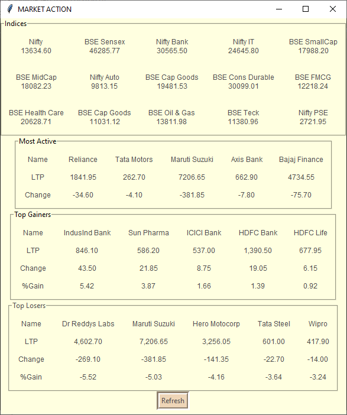

# Market_Action
A GUI based application developed using Python and its Tkinter package which scrapes data from moneycontrol.com using BeautifulSoup and requests and displays stock prices of top indices of Indian Stock Market and Most Active, Top Gainers and Top Losers shares trading on the National Stock Exchange.

